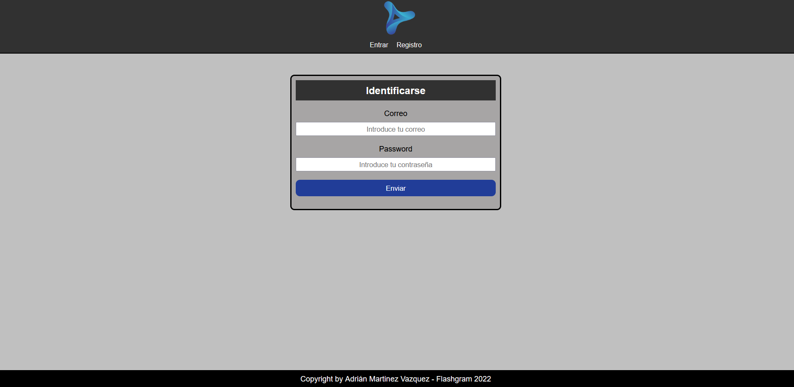
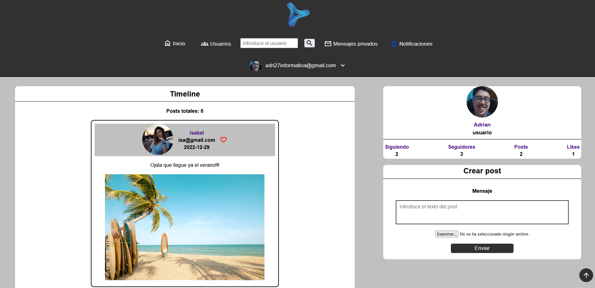
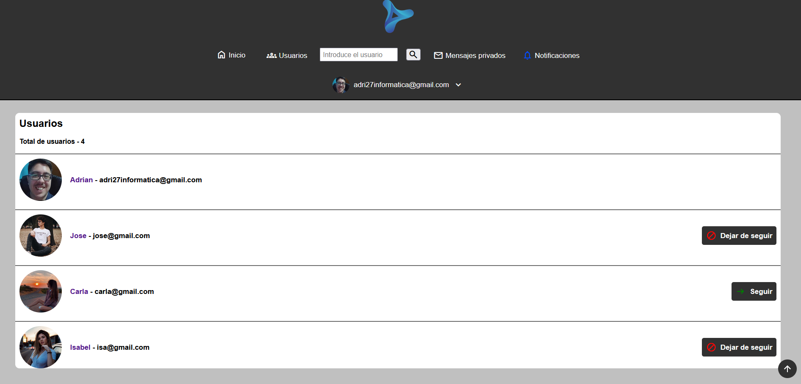
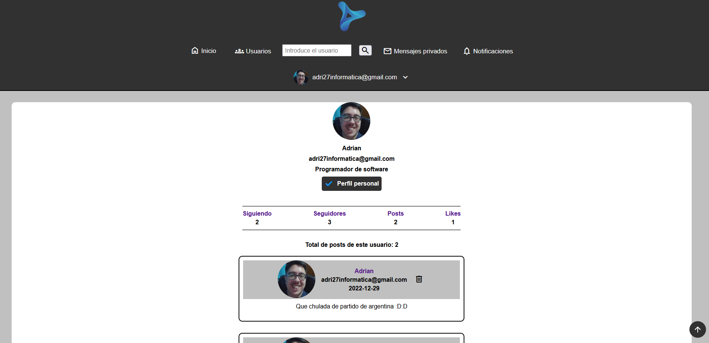
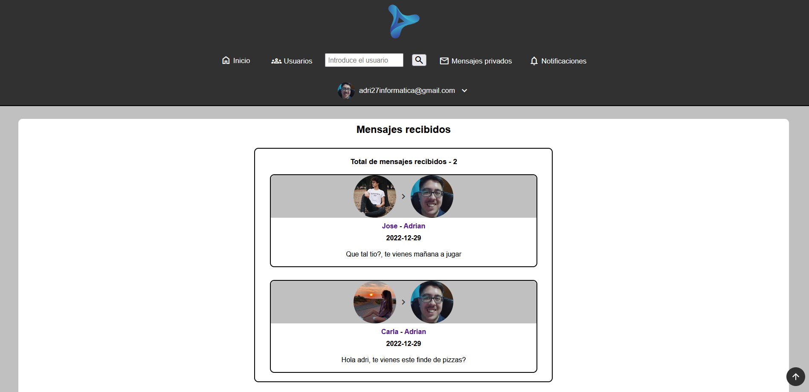
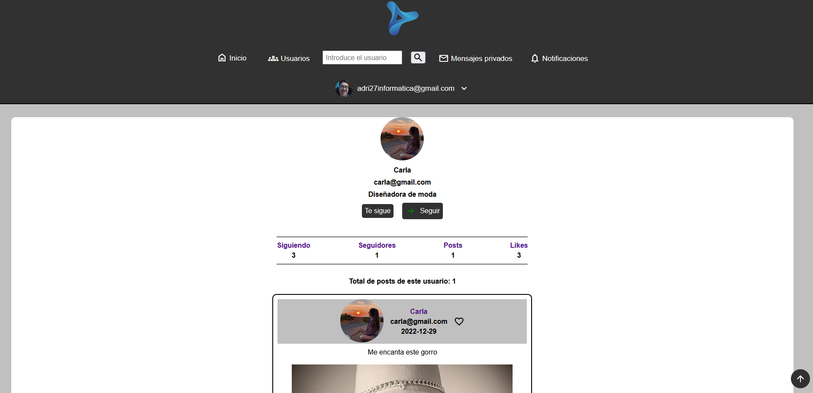

# Flashgram

This is a php project based on a social network.

Some images.

---

---

---

---

---

---

## Table of contents

- [Description](#description)
- [Technologies](#technologies)
- [Installation](#installation)

## Description

This is a php project based on a social network.

In this social network, you can create and delete your own posts, follow, write, and like the posts of other users logged into the social network. You can do all this if you log in before entering the web.

You can also see the statistics of the users and your own about the people who follow you, the people you follow, the likes you have made to the posts of other users and the posts you have created.

This application has error validation, user role validation, access security through tokens and error control.

## Technologies

The project has been created with:

- HTML
- CSS
- PHP 7.4
- JS

## Installation

To run this project, we need the following steps:

- Download XAMPP at the following link: https://www.apachefriends.org/

- Open XAMPP control panel and turn on apache and mysql services.

- Go to your browser to the path of localhost/phpmyadmin and you will see the phpmyadmin database manager running.

- Once inside the phpmyadmin database manager, you have to click the import option. You must select the sql file, which is located in the recursos/utilidades/conectividad/bbdd/sql folder of this project, which is the following: https://github.com/adri27info/Flashgram/blob/master/recursos/utilidades/conectividad/bbdd/sql/flashgram.sql

- Once the database is imported through the sql file, we go to the htdocs folder and create the apps/php/ folder and put the Flashgram project inside the php folder, so that everything works. Once this is done we put in the browser http://localhost/apps/php/Flashgram and we will see that the application will execute correctly.

- Finally to enter the application you just have to follow the steps and register
